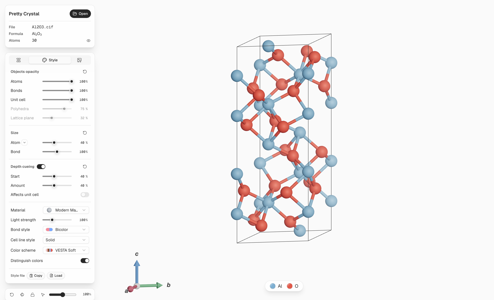

<h1 align="center">Pretty Crystal</h1>

<p align="center">
  Pretty Crystal is a crystal visualization tool for creating beautiful, publication-ready figures.
</p>
<p align="center">
  <a href="https://github.com/xyin-anl/pretty-crystal/actions/workflows/ci.yml"></a>
  
  
</p>

- **Pretty**: tasteful defaults for colors, materials, lighting, and depth
- **Simple**: an intuitive browser GUI for loading, viewing, and exporting structures
- **Reliable**: structure parsing and analysis powered by the mature [pymatgen](https://github.com/materialsproject/pymatgen) package
- **Scalable**: smooth interaction with systems up to 10k atoms
- **Customizable**: tune colors, radii, materials, opacity, orientation, and export settings

<p align="center">
  
</p>


## Why

I always find it harder than it should be to make a good-looking crystal figure.

Traditional crystallographic tools such as VESTA are powerful, but their visual defaults often feel outdated: harsh color palettes, low-quality 3D shading, and a lot of manual tweaking before the result looks acceptable. You could import the structure into professional 3D software such as Cinema 4D or Blender, but that feels like overkill and comes with a much steeper learning curve.

Pretty Crystal is my attempt to fill that gap. Built on [Three.js](https://github.com/mrdoob/three.js), it stays (relatively) lightweight without compromising visual quality. It offers a modern, intuitive interface with familiar controls researchers expect, and produces clean, aesthetically pleasing figures out of the box.

> [!NOTE]
> By design, Pretty Crystal focuses on **visualization**. It is not intended to replace mature materials-analysis tools such as VESTA and Materials Studio, and it does not try to provide complex structure editing or analysis workflows. Input files are treated as read-only. The intended workflow is to prepare and analyze structures with more specialized tools, then bring the final structure into Pretty Crystal for viewing, styling, and export.

## Install

Pretty Crystal is not published to a package index yet, so run it from source. You need [uv](https://github.com/astral-sh/uv) for the Python server and [Bun](https://bun.sh) to build the web app:

```shell
git clone https://github.com/xyin-anl/pretty-crystal.git
cd pretty-crystal
cd web && bun install && bun run build && cd ..
```

Requirements:

- Python 3.12+
- macOS, Linux, or Windows
- Any modern browser

## Quick start

Start the local GUI:

```shell
uv run prc gui
```

Pretty Crystal starts a local server and opens your browser automatically.

Useful launch options:

```shell
uv run prc gui --no-open     # start the server without opening a browser
uv run prc gui -p 0          # choose any available port automatically
```

### Batch rendering

Render figures for many structures from the command line, without opening the GUI:

```shell
uv sync --extra render
uv run playwright install chromium

uv run prc render structures/*.cif -o figures/ -m tachyon --width 2400
uv run prc render structures/*.cif --style mystyle.json -o figures/
```

Batch output uses the same rendering pipeline as the GUI, so figures come out
pixel-identical to interactive exports. See
[docs/batch-rendering.md](docs/batch-rendering.md) for the style-file reference.

## Examples

### Material presets

<p align="center">
  
</p>

### Color scheme presets

<p align="center">
  
</p>

## Contributing

This project is still in an early stage, and the main functionality is not complete yet.

For now, development is maintainer-led, and I’m not accepting pull requests. This helps keep the project direction focused while the core experience is still being shaped.

You’re welcome to fork the project or open issues for bug reports, suggestions, or feedback.

## Credits

This repository is adapted from [pretty-lattice](https://github.com/songfeitong/pretty-lattice) by Feitong Song.

## License

Pretty Crystal is released under the [MIT License](LICENSE).
